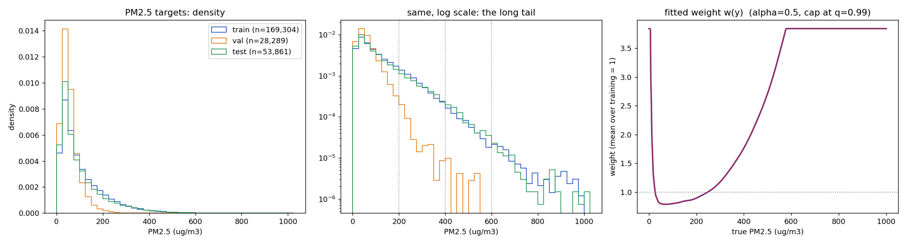
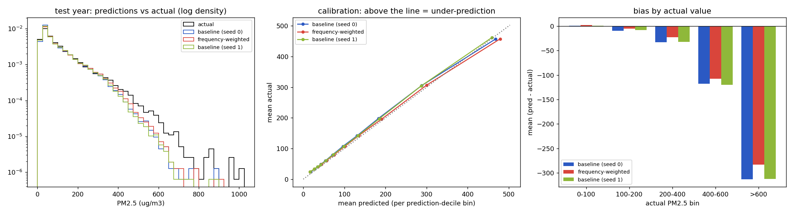

# Frequency-weighted MAE: does it fix the under-prediction of severe PM2.5?

**Recommendation: keep as an optional mode (off by default). Do not adopt as the default loss, and do not reject.**
In the direction intended, the weighted loss lowers error and average under-prediction on the rare, very polluted hours, and raises error on clean
hours and lowers +24 h skill. **But with one run per arm those tail and bias differences are smaller than the difference between two training runs that compute
the same forecast, so they cannot be told apart from ordinary training randomness** (section 6). Overall error is unchanged and the crop-burning-season
bias that motivated the experiment is not fixed. The only effect larger than the noise is a cost (-0.018 skill at +24 h).

---

## 1. Motivation

On the full-model run trained on real CPCB data, the forecast sits below the observed value on average:

| Season (test year) | Bias (pred - actual, ug/m3) |
|---|---|
| Crop-burning + Diwali (Oct 10 - Nov 30) | -16.6 |
| Winter smog (Dec - Feb) | -12.8 |
| Spring / dust (Mar - Jun) | -6.3 |
| Monsoon / early post-monsoon | -4.7 |

and on hours whose actual PM2.5 was above 400 it averages 353 against an actual 489. A plain MAE is minimised at the
conditional *median*; PM2.5 is strongly right-skewed, so the median sits below the mean and below the spikes. Frequency
weighting (up-weight rare target values) is a standard remedy for long-tailed regression targets, so we tested it as a
controlled experiment: **only the loss changes**.

## 2. Method

### 2.1 Loss

For every training target `y` (true PM2.5 at one station, one horizon), a weight `w(y)` multiplies that target's absolute error:

```
z      = log1p(y)
p(z)   = Gaussian kernel density of the training z's           (bandwidth by Scott's rule: h = 1.06 * std(z) * n^(-1/5))
w0(y)  = p(z(y)) ^ (-alpha)                                      alpha = 0.5   (square-root inverse frequency)
w1(y)  = min( w0(y), Q_0.99( w0 over the training targets ) )    cap at the 99th percentile of the training weights
w(y)   = w1(y) / mean_train(w1)                                  rescale so the average training weight is exactly 1

L_MAE  = sum_i w(y_i) * |yhat_i - y_i| * mask_i  /  sum_i mask_i
```

* **Data-driven, no pollution thresholds.** The only inputs are the training targets themselves. `alpha = 0.5` and the
  cap quantile `0.99` were fixed in advance and not tuned on validation or test.
* **Log scale** so a 100 -> 200 step and a 400 -> 800 step count alike.
* **Stability.** Softening by `alpha = 0.5` (pure inverse frequency would give the rarest hours weights in the hundreds),
  the 99th-percentile cap, and mean-1 normalisation. Result: weights range 0.79 - 3.84 (a 4.9x ratio), and the loss keeps
  the same overall scale, so `lambda_nll`, the physics terms and the learning rate keep their meaning.
* **Only the MAE term is weighted.** The Gaussian NLL, exceedance BCE and physics terms are unchanged.
* Style follows label-distribution-smoothing (Yang et al., "Delving into Deep Imbalanced Regression", ICML 2021); the exact
  form above is ours. Code: `src/aqf/losses/frequency.py`; switch: `TrainConfig.use_frequency_weighting` (default `False`).

Fitted weights (`runs/loss_exp/H_full_model_freqw/frequency_weights.json`):

| True PM2.5 | 10 | 25 | 50 | 100 | 150 | 200 | 300 | 400 | 500 | 600+ |
|---|---|---|---|---|---|---|---|---|---|---|
| weight | 2.58 | 1.03 | 0.80 | 0.80 | 0.84 | 0.90 | 1.18 | 1.76 | 2.71 | 3.84 (cap) |

The weight is U-shaped: the *cleanest* hours are also rare, so they are up-weighted too (see `docs/figures/pm25_target_distribution.png`, right panel).

### 2.2 What was held fixed

Same architecture (the full model, variant H), same data (`data/real_cpcb`), same splits, same optimiser and
hyperparameters (Adam, lr 1e-3, weight decay 1e-5, batch 16, grad-clip 5, hidden size 32, stride 6), **30 epochs, seed 0** as
the most recent CPCB baseline. Checkpoint selection is also unchanged: the epoch with the lowest (unweighted) validation MAE.

* **Baseline** = `runs/cpcb_long/H_full_model` (current loss, seed 0).
* **Weighted** = `runs/loss_exp/H_full_model_freqw` (same recipe, weighted MAE).
* **Noise yardstick** = `runs/loss_exp_seed1/H_full_model`: the baseline recipe with seed 1 (`make_split` also uses the seed, so
  it changes the held-out stations as well as the initialisation).
* **Reproducibility check.** Before the experiment, re-running one epoch of the baseline with the modified code reproduced the
  original run to every printed digit (train loss 0.4696, validation MAE 19.3162), so the unweighted code path is unchanged and the
  baseline-vs-weighted comparison is paired at the same seed.

Evaluation: test year 2025-09-01 .. 2026-09-20, all 15 stations, genuinely observed hours only, +1 h / +6 h / +24 h pooled unless stated.
Reproduce with `scripts/target_distribution.py` and `scripts/loss_experiment_eval.py`.

## 3. Data distribution analysis

Targets are exactly what the loss sees: observed PM2.5 at all three horizons, training-stride windows, non-held-out stations.



| | n targets | mean | median | p95 | p99 | max | > 200 | > 400 | > 600 |
|---|---|---|---|---|---|---|---|---|---|
| **train** (Jan 2022 - Feb 2025) | 169,304 | 109.2 | 76.5 | 305 | 454 | 998 | 25,818 (15.25%) | 2,979 (1.76%) | 446 (0.26%) |
| **validation** (Feb - Aug 2025) | 28,289 | 57.4 | 47.0 | 135 | 200 | 531 | 279 (0.99%) | **14 (0.05%)** | **0 (0.00%)** |
| test (Sep 2025 - Sep 2026) | 53,861 | 103.9 | 68.0 | 317 | 464 | 1000 | 7,604 (14.12%) | 1,119 (2.08%) | 112 (0.21%) |

Share of targets per PM2.5 bin:

| bin | train n | train % | val n | val % | test n | test % |
|---|---|---|---|---|---|---|
| 0-25 | 19,550 | 11.55 | 4,858 | 17.17 | 7,053 | 13.09 |
| 25-50 | 36,831 | 21.75 | 9,998 | 35.34 | 13,602 | 25.25 |
| 50-100 | 45,729 | 27.01 | 9,951 | 35.18 | 13,636 | 25.32 |
| 100-150 | 25,087 | 14.82 | 2,530 | 8.94 | 7,503 | 13.93 |
| 150-200 | 16,173 | 9.55 | 664 | 2.35 | 4,414 | 8.20 |
| 200-300 | 16,937 | 10.00 | 236 | 0.83 | 4,465 | 8.29 |
| 300-400 | 5,998 | 3.54 | 37 | 0.13 | 2,061 | 3.83 |
| 400-500 | 1,943 | 1.15 | 10 | 0.04 | 761 | 1.41 |
| 500-600 | 609 | 0.36 | 5 | 0.02 | 253 | 0.47 |
| 600-800 | 356 | 0.21 | 0 | 0.00 | 94 | 0.17 |
| >800 | 91 | 0.05 | 0 | 0.00 | 19 | 0.04 |

Two consequences:

1. **The extremes are genuinely rare** (1.8% of training targets above 400, 0.26% above 600) - the premise of the method holds.
2. **The validation split cannot judge the tail.** Validation (Feb - Aug 2025, mostly clean-air months) has 14 targets above 400 and none above 600, so
   both checkpoint selection and any validation number are blind to extreme-event skill. Only the test year can show it.

## 4. Results

Every number below is from `runs/loss_exp/comparison.json`. "Seed noise" in the next table is |baseline seed 1 - baseline seed 0| for the same metric; it is only one of two noise samples, see section 6.

### 4.1 Headline

| | Baseline (seed 0) | **Weighted (seed 0)** | Baseline (seed 1) | change from loss | seed noise |
|---|---|---|---|---|---|
| Validation MAE (selected checkpoint) | 16.48 | 16.85 | 17.02 | +0.37 | 0.54 |
| **Test MAE** | 25.89 | 26.14 | 25.90 | +0.26 | 0.01 |
| Test bias (pred - actual) | -8.87 | -5.44 | -8.25 | **+3.43** | 0.62 |
| Skill vs persistence +1 h | +0.113 | +0.116 | +0.118 | +0.003 | 0.006 |
| Skill vs persistence +6 h | +0.406 | +0.404 | +0.408 | -0.002 | 0.002 |
| Skill vs persistence +24 h | +0.150 | **+0.132** | +0.144 | **-0.018** | 0.006 |
| Overall skill (all horizons) | +0.263 | +0.256 | - | -0.007 | - |
| Best epoch | 24 | 30 | 30 | | |

Per-horizon bias: +1 h -0.77 -> -0.52; +6 h -8.60 -> -4.09; +24 h -15.32 -> -11.67.

### 4.2 Seasonal breakdown (MAE | bias | skill vs persistence)

| Season | Baseline s0 | **Weighted** | Baseline s1 |
|---|---|---|---|
| Crop-burning + Diwali (Oct 10 - Nov 30) | 43.07 \| -16.60 \| +0.284 | 43.74 \| **-14.68** \| +0.273 | 42.71 \| -18.35 \| +0.290 |
| Winter smog (Dec - Feb) | 39.42 \| -12.75 \| +0.278 | 39.46 \| **-3.78** \| +0.278 | 39.27 \| -10.70 \| +0.281 |
| Spring / dust (Mar - Jun) | 19.51 \| -6.28 \| +0.270 | 19.72 \| -3.40 \| +0.262 | 19.62 \| -4.73 \| +0.265 |
| Monsoon / early post-monsoon | 13.37 \| -4.72 \| +0.172 | 13.66 \| -4.41 \| +0.155 | 13.60 \| -5.05 \| +0.158 |

### 4.3 Error on extreme events (actual value above a threshold)

| Actual > | n | | MAE | bias | recall | precision | persistence MAE |
|---|---|---|---|---|---|---|---|
| 200 | 9,025 | baseline s0 | 70.4 | -49.1 | 0.75 | 0.86 | 83.1 |
| | | **weighted** | 67.2 | -38.8 | 0.78 | 0.83 | |
| | | baseline s1 | 69.1 | -48.9 | 0.76 | 0.86 | |
| 400 | 1,395 | baseline s0 | 145.4 | -136.7 | 0.33 | 0.68 | 134.8 |
| | | **weighted** | 133.5 | -124.2 | 0.38 | 0.64 | |
| | | baseline s1 | 145.2 | -138.3 | 0.32 | 0.74 | |
| 600 | 131 | baseline s0 | 317.7 | -315.5 | 0.11 | 0.56 | 261.1 |
| | | **weighted** | 287.2 | -285.0 | 0.11 | 0.47 | |
| | | baseline s1 | 316.3 | -314.9 | 0.11 | 0.58 | |

### 4.4 Normal and moderate days (by actual value, MAE | bias)

| Actual PM2.5 | n | Baseline s0 | **Weighted** | Baseline s1 |
|---|---|---|---|---|
| 0 - 100 | 39,721 | 13.9 \| +0.5 | 14.8 \| +2.0 | 14.4 \| +0.9 |
| 100 - 200 | 13,966 | 31.0 \| -9.6 | 31.7 \| -5.0 | 30.7 \| -7.9 |
| 200 - 400 | 7,691 | 56.6 \| -32.9 | 55.0 \| -23.0 | 55.1 \| -32.4 |
| 400 - 600 | 1,271 | 127.4 \| -118.1 | 117.3 \| -107.3 | 127.2 \| -119.8 |
| > 600 | 133 | 315.0 \| -312.8 | 284.9 \| -282.8 | 313.6 \| -312.2 |

## 5. Extreme-event analysis: actual > 400 subset

On the 1,395 target hours whose actual value exceeds 400 (mean actual 489):

| | Baseline s0 | **Weighted** | Baseline s1 |
|---|---|---|---|
| Mean prediction | 353 | 365 | 351 |
| MAE | 145.4 | 133.5 | 145.2 |
| Bias | -136.7 | -124.2 | -138.3 |
| Recall (predicted above 400) | 0.327 | 0.376 | 0.316 |
| Predictions above 400 (total, of which actual > 400 are recalls) | 670 | 825 | 599 |

By horizon (n; mean actual -> mean prediction | MAE vs persistence MAE):

| Horizon | n | Baseline s0 | **Weighted** | Persistence |
|---|---|---|---|---|
| +1 h | 447 | 488 -> 446 \| 61 | 488 -> 454 \| 55 | 59 |
| +6 h | 474 | 490 -> 331 \| 164 | 490 -> 352 \| 143 | 184 |
| +24 h | 474 | 490 -> 287 \| 207 | 490 -> 294 \| 198 | **158** |

At +24 h both models are *worse than persistence* on these hours (207 and 198 vs 158).

### Prediction distribution vs actual distribution



| Percentile of observed test hours | actual | baseline s0 | **weighted** | baseline s1 |
|---|---|---|---|---|
| 5 | 16 | 19 | 18 | 18 |
| 50 | 69 | 61 | 64 | 63 |
| 90 | 244 | 223 | 233 | 225 |
| 95 | 322 | 287 | 300 | 288 |
| 99 | 469 | 403 | 416 | 398 |
| 99.9 | 666 | 550 | 557 | 544 |
| mean | 105.4 | 96.5 | 99.9 | 97.1 |

| Share of hours above | actual | baseline s0 | **weighted** | baseline s1 |
|---|---|---|---|---|
| 200 | 14.38% | 12.43% | 13.44% | 12.72% |
| 400 | 2.22% | 1.07% | 1.31% | 0.95% |
| 600 | 0.21% | 0.04% | 0.05% | 0.04% |

Calibration (mean actual in each prediction-decile bin; conditioning on the *prediction* avoids the selection effect of conditioning on the actual):

| Predicted bin | baseline s0: mean pred / mean actual | **weighted**: mean pred / mean actual |
|---|---|---|
| 0 - 24 | 18.2 / 24.3 | 16.9 / 24.5 |
| 48 - 61 | 53.8 / 60.2 | 56.5 / 60.7 |
| 83 - 112 | 96.5 / 107.2 | 100.7 / 106.6 |
| 152 - 223 | 183.0 / 198.2 | 190.5 / 195.7 |
| 223 - 403 | 287.7 / 305.1 | 300.0 / 306.7 |
| 403 - 896 (top 1%) | 467.4 / 457.0 | **478.9 / 457.8** |

## 6. Comparison with training noise

Two independent measures of run-to-run variation are available on this data, and **they disagree by an order of magnitude**, so I report both:

* **Noise sample 1 - baseline seed 1 vs seed 0** (same recipe, different seed; the seed also changes the held-out stations). The two runs came out almost identical.
* **Noise sample 2 - variant G vs variant H, both seed 0.** G and H compute the *same forecast*: H only adds the source and regime heads, which have no labels on real data, receive no gradient and do not touch the forecast. They differ only in the random stream consumed during construction and training (initialisation order, dropout, batch shuffling). Their numbers differ a lot.

Older measurements on the earlier (estimated-label) data point the same way: three seeds each of A and G had test-MAE spreads of 0.27 and 0.28, and G vs H differed by 0.40.

| Metric | **change from the loss** (weighted - baseline s0) | noise sample 1 (s1 - s0) | noise sample 2 (G - H) | within the noise range? |
|---|---|---|---|---|
| Test MAE | +0.26 | +0.01 | +0.42 | **yes** |
| Validation MAE | +0.36 | +0.53 | +0.09 | yes |
| Overall bias | +3.43 | +0.62 | +8.48 | yes (above sample 1, below sample 2) |
| Skill +24 h | -0.018 | -0.006 | -0.003 | **no - larger than both** (a cost) |
| MAE, actual > 200 | -3.26 | -1.32 | -6.11 | yes |
| Bias, actual > 200 | +10.37 | +0.19 | +24.43 | yes |
| MAE, actual > 400 | -11.97 | -0.24 | **-24.90** | yes |
| Bias, actual > 400 | +12.55 | -1.56 | **+33.72** | yes |
| Recall, actual > 400 | +0.049 | -0.011 | +0.118 | yes |
| MAE, actual > 600 | -30.58 | -1.39 | **-46.24** | yes |
| Bias, actual > 600 | +30.47 | +0.60 | +47.67 | yes |
| MAE, actual < 100 | +0.91 | +0.44 | +1.09 | yes |
| Bias, actual < 100 | +1.44 | +0.37 | +3.85 | yes |
| MAE, actual 100 - 200 | +0.66 | -0.33 | +2.71 | yes |
| Bias, crop-burning season | +1.92 | -1.75 | +15.33 | yes |
| Bias, winter | +8.98 | +2.05 | +17.09 | yes |

How to read this:

* **Every tail and bias effect of the weighted loss is smaller than the difference between two runs that compute the same forecast** (sample 2), and
  those differences point the *same way* as the weighting (less negative bias, lower error on severe hours, higher error on clean hours). Both lie on one
  trade-off axis - how hard the model chases the tail - and ordinary training randomness moves a model along that axis by more than the weighting did.
* Sample 1 shows the noise can also be tiny. A one-run-per-arm comparison therefore cannot tell the weighting's effect from luck; the two samples bracket
  it, and the ratios obtainable from sample 1 alone (up to 49x on MAE above 400) would be misleading.
* The only difference that exceeds both noise samples is the **loss of +24 h skill** (-0.018 vs -0.006 and -0.003) - a cost, not a benefit.
* The day-block bootstrap intervals (weighted - baseline: test MAE [-0.11, +0.61]; bias [+2.68, +4.12]; MAE above 400 [-20.3, -4.1]; bias above 400 [+3.5, +22.7])
  capture only *test-sampling* uncertainty (which days fell in the test year), not training randomness, so they are narrower than the real uncertainty and should not be read as significance.

## 7. Trade-offs: what moved in each direction

What follows describes this one weighted run. Direction matches what the method intends; none of the tail items is established beyond training variance (section 6).

**Moved in the intended direction:**
* Error on the rarest hours: MAE -4.6% above 200, -8.2% above 400, -9.6% above 600.
* Overall average under-prediction down by about 39% (-8.87 -> -5.44), mostly in winter (-12.75 -> -3.78) and at +6 h / +24 h.
* Recall of > 400 hours 0.33 -> 0.38; upper forecast quantiles up (p99 403 -> 416; share of hours predicted above 400 from 1.07% to 1.31%).
* Mid-range calibration (prediction bins 83 - 403) closer to the diagonal.

**Moved the wrong way:**
* Clean and moderate hours: MAE on actual < 100 from 13.9 to 14.8 (+6.5%) with the model starting to over-predict there (+0.5 -> +2.0); 100 - 200 MAE +2.1%.
* Skill at +24 h: +0.150 -> +0.132 (the one effect larger than both noise samples).
* Precision on severe hours: > 400 from 0.68 to 0.64; > 600 from 0.56 to 0.47 (more false alarms).
* The top calibration bin now over-predicts (mean predicted 479 vs actual 458).

**Unchanged:** overall test MAE (+0.26), +1 h and +6 h skill, recall above 600 (0.11 for every model), and **the crop-burning-season bias** (-16.6 -> -14.7, smaller than the difference between the two noise samples).

**Not fixed:** the tail stays heavily under-predicted. Even after weighting, 1.31% of hours are predicted above 400 (actual 2.22%) and 0.05% above 600 (actual 0.21%).

## 8. Real improvement, or merely redistributed error?

On this evidence, redistribution at best. Total error did not go down (test MAE +0.26, overall skill +0.263 -> +0.256, +24 h skill worse). Whatever tail improvement exists was bought
with a loss on the much more common clean hours.

Two readings of the tail numbers need care:

1. **The large negative bias on "actual > 400" hours is mostly a selection effect.** Choosing hours *because* the actual was extreme selects the hours a forecaster
   could not anticipate, so any forecaster under-predicts them (regression to the mean). The baseline's own calibration shows it: in its highest prediction bin
   (predicted 467) the actual mean is 457 - no under-prediction when conditioning on the forecast. That part of the gap is forecast uncertainty (when a spike arrives at +6 h and +24 h)
   and cannot be removed by a loss function.
2. **At +24 h on actual > 400 hours both models are worse than persistence** (207 and 198 vs 158), while at +6 h they are better (164 and 143 vs 184).
   Severe-hour skill is horizon-dependent and weighting does not change that picture.

## 9. Conclusion

The frequency-weighted MAE moves the model in the direction it is designed to: lower error and less average under-prediction on the rare, very polluted hours, at the price of
higher error on clean hours and lower +24 h skill. **But with one run per arm none of the tail or bias gains can be told apart from ordinary training randomness**:
two models that compute the same forecast differ by more than the weighting does (section 6). The one effect that does exceed noise is a cost (the +24 h skill loss).
It does not fix the crop-burning-season bias that motivated the experiment, it leaves overall error unchanged, and the tail stays heavily under-predicted.
It should not replace the current loss, and the experiment does not support claiming that it helps.

## 10. Recommendation: **Keep as optional mode** (experimental, unproven)

* Leave `use_frequency_weighting = False` as the default; keep the implementation (`scripts/train_long.py --freq-weighting`) available. It is cheap, principled, off by default, and the only effect that
  clears the noise is a small +24 h skill cost, which does not justify deleting it - but nothing here justifies adopting it either.
* Not "adopt immediately": no benefit is established beyond training variance, and there are measurable costs (clean-day error, +24 h skill, precision).
* Not "reject": the direction of the tail changes is as intended and consistent across metrics; rejecting would claim more than the data show.
* What would settle it: at least three seeds per arm (about six hours of training) so that the weighted-vs-baseline gap can be compared with a real noise estimate;
  a validation set that contains extremes (e.g. time-blocked folds covering Oct - Jan), because the current one cannot select a checkpoint or tune `alpha` for tail performance;
  and, if the aim is severe-episode warning, upper-quantile outputs, which target the tail directly instead of re-weighting a mean-seeking loss.

## 11. Limits

* One weighted run (seed 0) and one extra baseline seed. The comparison with noise uses two noise samples that disagree by an order of magnitude, so the noise is poorly measured; the bootstrap covers test-day sampling only.
* The seed-1 baseline also changes the held-out stations, so its noise includes that source; the G-vs-H sample keeps the held-out stations fixed.
* `alpha = 0.5`, cap quantile 0.99 and the log-density estimator were fixed a priori; other settings were not explored.
* Both the weighted and seed-1 runs peaked at epoch 30 (the last), so the 30-epoch budget may be limiting.
* Validation contains almost no extremes (section 3), so checkpoint selection could not favour tail performance for the weighted run.
* The crop-burning-season result rests on a single season in the test year.
* G was not trained with the weighted loss; it is used here only as a noise sample (same forecast function as H, different random stream).

Files: `src/aqf/losses/frequency.py`, `scripts/target_distribution.py`, `scripts/loss_experiment_eval.py`, `runs/loss_exp/comparison.json` and `runs/loss_exp/_selftest.json`
(git-ignored), `docs/figures/pm25_target_distribution.png`, `docs/figures/frequency_weighted_loss_comparison.png`.
